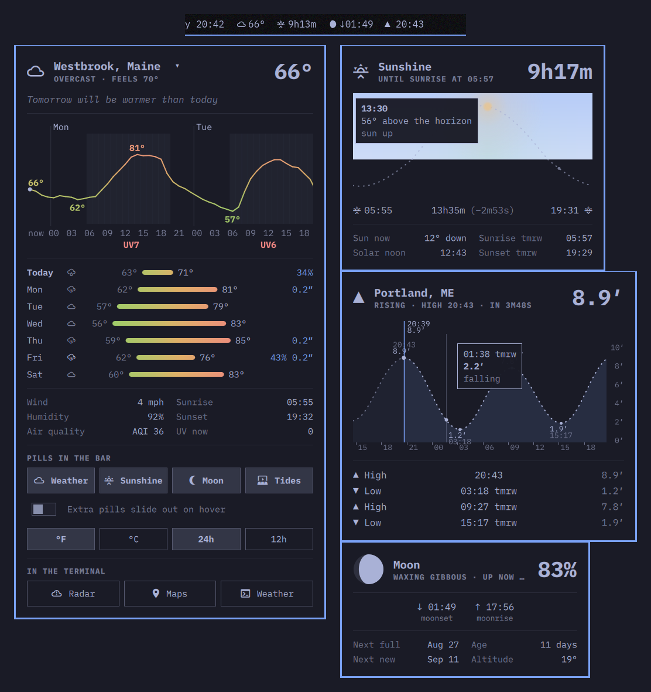

# omarchy-linecast

An [Omarchy](https://omarchy.org) bar-widget plugin for
[linecast](https://github.com/ashuttl/linecast) — terminal weather, solar
arc, moon, and tides.



## What you get

- **Weather pill**, always visible: icon + temperature, full oneline summary
  as tooltip. **Sunshine, moon, and tide pills** tuck away and slide out on
  hover (the same gesture as the stock indicators widget).
- **Or take the pills apart**, with the companion plugins — weather beside
  the clock, tides over by the tray, each dragged where you want it. See
  [Placing the pills separately](#placing-the-pills-separately).
- **Left click on any pill opens its panel**, anchored to that pill; right
  click opens the full linecast TUI in a floating terminal. `r` refetches,
  `Escape` closes, `Tab` switches to neighboring bar panels.
- **Weather panel**: current conditions with the plain-English comparison
  line, weather alerts, a 24-hour temperature strip and a week of range
  bars in linecast's temperature colors, and wind / humidity / sun times /
  AQI at a glance.
- **Sunshine panel**: countdown to the next sunrise/sunset over a drawn
  solar arc with the sun at its current position, day length and its
  day-to-day drift, solar noon, tomorrow's sunrise.
- **Moon panel**: a drawn phase disc (correct terminator, hemisphere
  aware), phase and illumination, moonrise/moonset, next full and new
  moons.
- **Tides panel**: countdown to the next high/low over the tide curve
  (past dimmed, extremes marked), the upcoming turns, and the station
  name.

## Requirements

- linecast with `weather --json` support (newer than v1.8.0; in the dev
  tree as of 2026-08-14)
- A Nerd Font in the bar (linecast's default glyph set)
- `jq` (used by the pill scripts)

## Install

```bash
omarchy plugin add https://github.com/ashuttl/omarchy-linecast.git --enable
```

Then add the widget to the bar if it wasn't added automatically:

```bash
omarchy bar move ashuttl.linecast --section center
```

## Settings

Inline in the widget's `shell.json` entry (hot-reloads on save):

- `pills` (default `["weather", "sunshine", "moon", "tides"]`) — which
  pills show, in display order. The first entry is the always-visible
  pill and hosts the popup; the rest slide out on hover.
  For example, weather and tides only:

  ```json
  { "id": "ashuttl.linecast", "pills": ["weather", "tides"] }
  ```

- `alwaysShow` (default `false`) — keep every pill out instead of sliding
  the extras in on hover.
- `weatherRefreshSeconds` (default 600) — weather pill refresh interval.

## Placing the pills separately

Each of the other three pills is also published as its own small plugin,
so it gets its own spot on the bar and its own panel anchored under it:

- [omarchy-linecast-sunshine](https://github.com/ashuttl/omarchy-linecast-sunshine)
- [omarchy-linecast-moon](https://github.com/ashuttl/omarchy-linecast-moon)
- [omarchy-linecast-tides](https://github.com/ashuttl/omarchy-linecast-tides)

```bash
omarchy plugin add https://github.com/ashuttl/omarchy-linecast-tides.git --enable
```

They're thin: each one is this plugin's `BarWidget` with its pill fixed and
a manifest of its own, loaded from `../ashuttl.linecast`. So they need this
plugin installed, and there's still only one copy of the scripts, the panel,
and the views. Tell this widget which pills to keep, so nothing shows twice:

```json
{ "id": "ashuttl.linecast", "pills": ["weather"] }
```

**Why separate plugins rather than several entries of this one?** Because
Omarchy identifies a bar widget by its plugin id and nothing else. Bar
reordering resolves the dragged widget with a first-match-by-id lookup
(`Bar.moveModuleInConfig`), so duplicate ids move whichever entry comes
first rather than the one under the pointer — and `omarchy bar move/set`
and `omarchy plugin enable/disable` all pick the first match too. Distinct
ids make drag-and-drop and the CLI work normally.

Grouping still works if you want it: any of these widgets takes a `pills`
list, and a widget carrying extras reveals them on its own hover as well as
on the bar's center-section hold, so it works parked in any section.

## Notes

The pills shell out to `scripts/linecast-*.sh`, which cache linecast's
`--oneline` output under `~/.cache/`; each panel face runs its
`linecast <command> --json` on first open and refetches when stale.
Location follows `linecast location`, and the picker's recents are shared
by every Linecast widget in
`~/.local/state/omarchy/linecast-recent-locations.json`.

Panels can be driven from scripts or keybindings:

```bash
omarchy-shell ashuttl.linecast openSection tides   # weather|sunshine|moon|tides
omarchy-shell shell toggle ashuttl.linecast        # last-used face
```

`openSection` finds the widget carrying that pill and opens its panel
there, including when that widget came from a companion plugin — so these
keep working however the pills are arranged. Each companion also answers
under its own id:

```bash
omarchy-shell ashuttl.linecast-tides toggle
```
